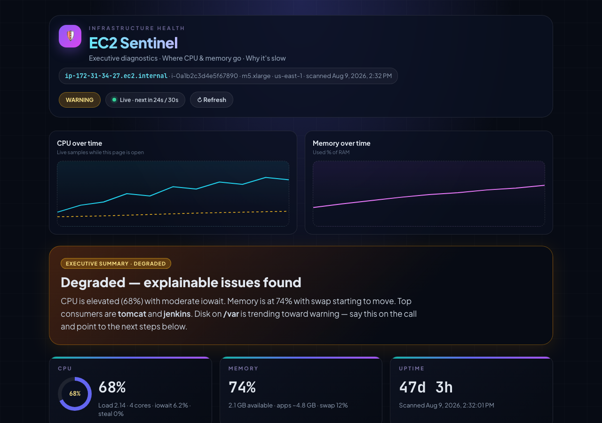

# EC2 Sentinel 🛡️

**A quick health check for the EC2 box you're already SSH'd into.**

DevOps engineers spend a lot of time answering the same questions on every instance: *What's eating CPU? Why is memory full? Which process from `ps -ef` is supposed to be running but isn't?* Add Jenkins, Bamboo, Bitbucket, Tomcat, or JBoss on top of that — and half the incident is just figuring out **what** broke before you can fix it.

EC2 Sentinel runs on the instance and gives you that answer in one place. Less time digging through `/proc`, logs, and port checks. More time actually fixing things.

[](https://www.python.org/downloads/)
[](LICENSE)
[](CONTRIBUTING.md)

---

## What you get

- **CPU, memory, disk, swap** — usage, load, and what's consuming resources
- **Processes** — is Jenkins / Bamboo / Tomcat / JBoss actually running? Did it restart?
- **Ports** — is the service listening on the port you expect?
- **Logs** — scans for OOM, disk full, CRITICAL/FATAL patterns
- **Plain-English diagnosis** — a short "why is this slow?" summary for the team
- **Alerts** — Slack, email, PagerDuty, or JSON to stdout

Runs locally on the instance. No AWS API keys. No central server required.

---

## Minimum requirements

| | |
|---|---|
| **OS** | Linux on EC2 — Amazon Linux 2/2023, Ubuntu 20.04+, RHEL 8+ |
| **Python** | 3.9+ with `pip` |
| **Dependencies** | One package: `PyYAML` (everything else is Python stdlib + `/proc`) |
| **AWS / IAM** | None — no API keys, no boto3, no CloudWatch agent |
| **Root** | Not required to run scans; `sudo` only if you install to `/opt` or use systemd |
| **Disk / RAM** | Negligible — no database, no heavy agents |

**Optional:** Docker CLI (for container checks), read access to log paths in your config, outbound HTTPS (for Slack/PagerDuty alerts).

**No Python?** Bash-only quick check — no install:

```bash
curl -sSL https://raw.githubusercontent.com/sandeepk24/ec2-sentinel/main/scripts/quick-check.sh | bash
```

---

## Install

**One command on the EC2 instance:**

```bash
curl -sSL https://raw.githubusercontent.com/sandeepk24/ec2-sentinel/main/install.sh | sudo bash
```

Installs to `/opt/ec2-sentinel`, adds the `ec2-sentinel` command, and creates `config.yaml`.

**Run it:**

```bash
sudo ec2-sentinel --once          # health report in the terminal
sudo ec2-sentinel --web           # dashboard → http://127.0.0.1:8765
sudo ec2-sentinel --daemon        # background monitoring + alerts
```

Edit `/opt/ec2-sentinel/config.yaml` for your Jenkins, Bamboo, Tomcat, etc.

**Run as a service (optional):**

```bash
curl -sSL https://raw.githubusercontent.com/sandeepk24/ec2-sentinel/main/install.sh | sudo bash -s -- --systemd
sudo systemctl status ec2-sentinel
```

Without `sudo`, the installer uses `~/.ec2-sentinel` instead of `/opt/ec2-sentinel`.

---

## Dashboard

<p align="center">
  <a href="docs/dashboard-preview-dark.html">
    
  </a>
</p>

<p align="center">
  Live charts, process status, and a plain-English diagnosis — <a href="docs/dashboard-preview-dark.html">open preview →</a>
</p>

Auto-refreshes every 5 minutes. Manual refresh anytime. Built React UI — no Node needed at runtime.

---

## Configure what matters on *this* server

Edit `config.yaml` and name the services you care about:

```yaml
sentinel:
  interval_seconds: 300          # scan every 5 minutes

processes:
  - name: jenkins
    match: "jenkins.war"
    port: 8443
  - name: bamboo
    match: "bamboo"
    port: 8085
  - name: tomcat
    match: "org.apache.catalina"
    port: 8080

log_watch:
  patterns:
    - "OutOfMemoryError"
    - "No space left on device"
    - "CRITICAL"
  files:
    - /var/log/syslog
    - /var/log/jenkins/jenkins.log

alerts:
  slack:
    enabled: true
    webhook_url: "${SENTINEL_SLACK_WEBHOOK}"
```

See `config.example.yaml` for thresholds, Docker checks, Java/JDK detection, and more.

---

## How it works

EC2 Sentinel is an **on-instance agent**. Install it on each EC2 you want to watch. It reads local `/proc`, log files, and port state — it does not SSH into other hosts or call AWS APIs.

```
  install on instance  →  scan CPU / mem / disk / processes / ports / logs  →  terminal, web UI, or alert
```

**Monitor multiple instances:** run `ec2-sentinel --once --json` on each box (cron works well), sync the JSON files to one host, then:

```bash
ec2-sentinel --web --reports-dir /path/to/fleet-json/
```

---

## Contributing

Got a check you run manually on every incident? Open a PR — PRs welcome for new collectors, alert channels, and app-specific checks.

## License

MIT
